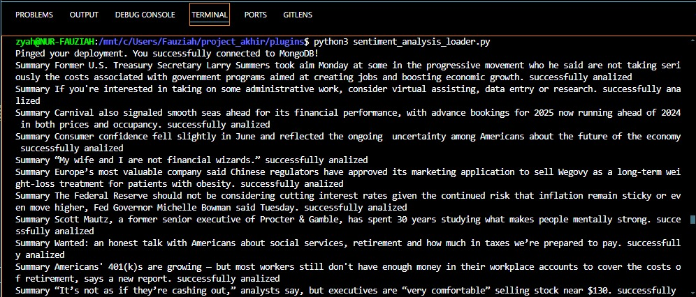

\***\*README.md\*\***
**Overview**
This README outlines the steps required to set up a data pipeline that fetches news from Finnhub, stores it in MongoDB Atlas, analyzes the news data, and loads the results into a PostgreSQL database. The entire process is scheduled and managed using Apache Airflow.

**Prerequisites**
Finnhub Account: Sign up for a Finnhub account to obtain an API key. Finnhub API Documentation
MongoDB Atlas: Sign up or log in to MongoDB Atlas and create a cluster or use an existing cluster. MongoDB Atlas
Docker: Ensure Docker is installed on your system.
PostgreSQL: Ensure PostgreSQL is installed and accessible.

**Steps**
Finnhub Account Setup:

Sign up for a Finnhub account and obtain your API key from Finnhub.
MongoDB Atlas Setup:

Sign up or log in to MongoDB Atlas.
Create a new cluster or use an existing cluster in MongoDB Atlas. MongoDB Atlas
Docker Compose Setup for Airflow:

Copy and paste the provided Airflow Docker Compose configuration into a file named docker-compose.yaml.
Airflow Docker Compose File
PostgreSQL Database Setup:

Create a new database in PostgreSQL that will be used to load the output table.
Python Code for Loading News to MongoDB:

Write a Python script to fetch news from Finnhub and load it into MongoDB Atlas.
Python Code for Analyzing News and Loading to PostgreSQL:

Write a Python script to analyze the news data stored in MongoDB Atlas and load the results into the PostgreSQL database.
Scheduling with Airflow:

**Create Airflow DAGs to schedule the execution of the Python scripts for loading news into MongoDB and for analyzing the news and loading the results into PostgreSQL.
Detailed Instructions**

1. Sign Up for Finnhub
   Go to the Finnhub sign-up page and create an account.
   Retrieve your API key from the Finnhub dashboard.
2. Set Up MongoDB Atlas
   Visit MongoDB Atlas and sign up or log in.
   Follow the instructions to create a new cluster or use an existing cluster.
   Obtain the connection string for your MongoDB Atlas cluster.
3. Airflow Docker Compose Configuration
   Create a file named docker-compose.yaml.
   Copy and paste the Airflow Docker Compose configuration from the following link: Airflow Docker Compose File.
4. Create New Database in PostgreSQL
   Connect to your PostgreSQL instance.
   Create a new database that will be used to store the output table.
5. Python Script to Load News into MongoDB
   Write a Python script that uses the Finnhub API to fetch news data.
   Insert the fetched news data into your MongoDB Atlas cluster.
6. Python Script to Analyze News and Load into PostgreSQL
   Write a Python script to analyze the news data stored in MongoDB.
   Load the analyzed data into the PostgreSQL database.
7. Schedule Tasks with Airflow
   Create Airflow DAGs to automate the execution of the Python scripts created in steps 5 and 6.
   Ensure that the DAGs are properly scheduled to run at desired intervals.

**Conclusion**
By following these steps, you will set up a data pipeline that fetches, stores, analyzes, and loads news data from Finnhub into MongoDB and PostgreSQL, all managed through Airflow. This setup enables efficient and automated data processing and analysis.

**OUTPUT**

